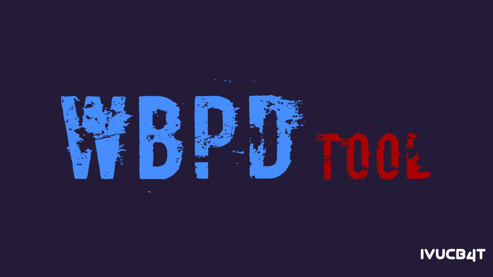
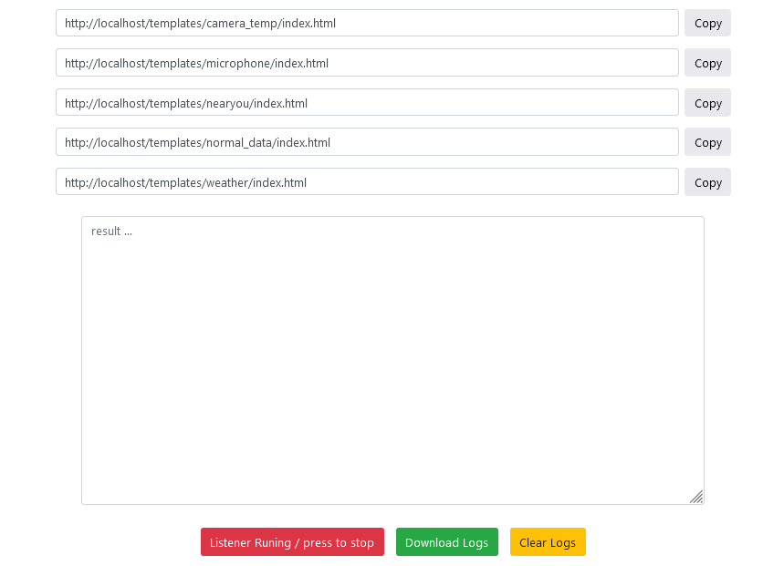
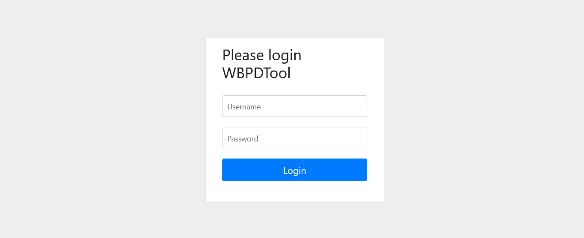
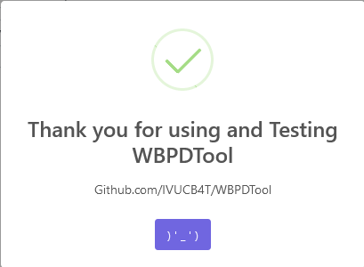

<h1 align="center">
  WBPDTool - Web based Phishing Demonstration Tool
</h1>

<h1 align="center">
   
  

</h1>

# WBPDTool

<h1 align="center">
   
  

</h1>

## Features :-

- Obtain Device Information Without Any Permission !
- Access Location [SMARTPHONES]
- Access Webcam
- Access Microphone

 

### :-------------------------------->

 

- The overall structure of the tool is programmed from the beginning and is available as a web Panel

- The templates have been optimized !

- Logs can be Downloaded  !

- Clear log  !

- It can be uploaded on a personal Host

- You can start and stop the listener anytime ! (At will)

- Beautified user interface  !

  

## Attention! :-

 

> This version can be run on both local host and your personal domain and host . However , you can use it for both situations.
 We suggest using the tool on your personal host and domain .
>
  

## Default username and password :-

- `username` : `WBPDTool`
- `password` : `WBPDTool`

### You can edit the config.php file to change the username and password .

 

 

   

## Platforms Tested

- Personal host (direct admin and cPanel)
   

## **`How to run personal host 👇`**
 

> Zip the contents of the WBPDTool folder completely and upload it to the public_html path .

> Note that the tool should not be opened in a path like this > yourdomain.com/WBPDTool

> Instead , it should be opened purely in the public_html path (i.e. : don't just zip the WBPDTool folder itself, but manually zip its contents (the index.php file and other belongings should be in the public_html path)

 

## Warning :-

**WBPDTool is only for Educational Purpose. If any user use WBPDTool is For illegal purpose or taking revenge, In this case the owner will not Responsible. Use of WBPDTool is Complete Responsibility of the user. If any User misuse WBPDTool then the tool and its owner will not Responsible.**

 

### Credits goes to <a href="https://github.com/ultrasecurity/Storm-Breaker"> ultrasecurity (Storm-Breaker)</a> and <a href="https://github.com/thewhiteh4t/seeker"> thewhiteh4t (seeker)</a>

 

<h1 align="center">
   
  

</h1>

 

<h1 align="center">
IVUCB4T  

 ) ' - ' )

## WBPDTool

## WBPDTool - Web based Phishing Demonstration Tool
